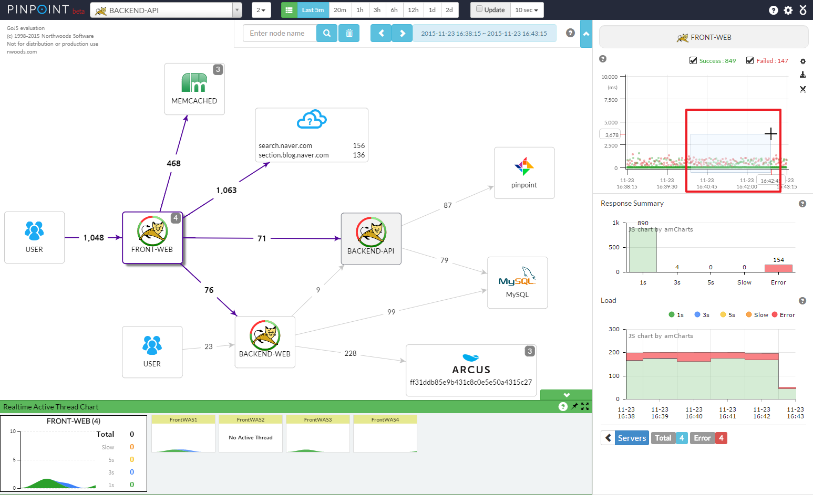

# Pinpoint APM Integration for OpenShift Container Platform

The objetive for this repository is to deploy the Pinpoint APM project (https://github.com/naver/pinpoint) on top of Openshift Container Platform.

1. Create the *pinpoint-apm* namespace on your Cluster

        # oc new-project pinpoint-apm

2. Import the template from source

        # oc create -f https://raw.githubusercontent.com/redhat-cop/containers-quickstarts/app_monitoring/master/kube/pinpoint-template-ephemeral.yaml

3. Create the new application from the imported template

        # oc new-app pinpoint-ephemeral-template

      --> Deploying template "pinpoint-ephemeral-template" in project "openshift"

           pinpoint-ephemeral-template
           ---------
           Pinpoint APM Ephemeral

           Pinpoint APM Ephemeral

      --> Creating resources with label app=pinpoint-ephemeral-template

          serviceaccount "pinpoint" created
          imagestream "pinpoint" created
          service "pinpoint-apm" created
          service "pinpoint-testapp" created
          service "pinpoint-collector" created
          route "webinterface" created
          route "testapp" created
          buildconfig "pinpoint" created
          deploymentconfig "pinpoint-apm" created

      --> Success

          Build scheduled, use 'oc logs -f bc/pinpoint' to track its progress.
          Run 'oc status' to view your app.

4. Add the pinpoint service account to anyuid Security Context Constraint so root user could start processes inside de image

        # oc adm policy add-scc-to-user anyuid system:serviceaccount:pinpoint-apm:pinpoint

The resulting container will automatically start HBASE, Collector and Web UI services. The required routes will also created to expose Web UI and a Test Application. This Test Application must be manually started once the container is running.

        # oc rsh {Pod}
        # /pinpoint/quickstart/bin/start-testapp.sh &> /pinpoint/logs/testapp.out &

#### ** Note that the Build process could take more than 30 minutes depending on your hardware and internet connection. A public image will be available in Docker Hub to directly use it


## Overview

* **ServerMap** - Understand the topology of any distributed systems by visualizing how their components are interconnected. Clicking on a node reveals details about the component, such as its current status, and transaction count.



* **CallStack** - Gain code-level visibility to every transaction in a distributed environment, identifying bottlenecks and points of failure in a single view.


* **Inspector** - View additional details on the application such as CPU usage, Memory/Garbage Collection, TPS, and JVM arguments.


## Architecture


## Using the Test Application

In order to quickly start playing with Pinpoint APM we can use the Test Application included in the image. Login to the running container and execute the following command.

      # /pinpoint/quickstart/bin/start-testapp.sh &> /pinpoint/logs/testapp.out &

And check the /pinpoint/logs/testapp.out log file output, looking for the application start.

      ```bash
      ---check pinpoint-quickstart-testapp process status.---
      ---initialize pinpoint-quickstart-testapp logs.---
      ---initialize pinpoint-quickstart-testapp agent.---
      ---pinpoint-quickstart-testapp initialization started. pid=31793.---
      starting pinpoint-quickstart-testapp. 0 /1000 sec(close wait limit).
      starting pinpoint-quickstart-testapp. 5 /1000 sec(close wait limit).
      starting pinpoint-quickstart-testapp. 10 /1000 sec(close wait limit).
      starting pinpoint-quickstart-testapp. 15 /1000 sec(close wait limit).
      starting pinpoint-quickstart-testapp. 20 /1000 sec(close wait limit).
      starting pinpoint-quickstart-testapp. 25 /1000 sec(close wait limit).
      starting pinpoint-quickstart-testapp. 30 /1000 sec(close wait limit).
      starting pinpoint-quickstart-testapp. 35 /1000 sec(close wait limit).
      starting pinpoint-quickstart-testapp. 40 /1000 sec(close wait limit).
      starting pinpoint-quickstart-testapp. 45 /1000 sec(close wait limit).
      ---pinpoint-quickstart-testapp initialization completed. pid=31793.---
      2017-02-13 14:08:12 [INFO ](c.n.p.p.i.ASMAspectWeaver          :121) weaving method=getHeaders(Ljava/lang/String;)Ljava/util/Enumeration;
      2017-02-13 14:08:12 [INFO ](c.n.p.p.i.ASMAspectWeaver          :121) weaving method=getHeaderNames()Ljava/util/Enumeration;
      2017-02-13 14:08:12 [DEBUG](c.n.p.b.i.BasicMethodInterceptor   :96 ) BEFORE org.springframework.web.servlet.DispatcherServlet  args:(RequestFacade, ResponseFacade)
      2017-02-13 14:08:12 [DEBUG](c.n.p.b.i.BasicMethodInterceptor   :96 ) BEFORE com.fasterxml.jackson.databind.ObjectMapper  args:(UTF8JsonGenerator, HashMap)
      2017-02-13 14:08:12 [DEBUG](c.n.p.b.i.BasicMethodInterceptor   :150) AFTER com.fasterxml.jackson.databind.ObjectMapper  args:(UTF8JsonGenerator, HashMap)
      2017-02-13 14:08:12 [DEBUG](c.n.p.b.i.BasicMethodInterceptor   :150) AFTER org.springframework.web.servlet.DispatcherServlet  args:(RequestFacade, ResponseFacade)
      2017-02-13 14:08:12 [DEBUG](.StandardHostValveInvokeInterceptor:121) AFTER org.apache.catalina.core.StandardHostValve  args:(Request, Response) result:null
      2017-02-13 14:08:12 [DEBUG](c.n.p.p.c.s.BufferedStorage        :92 ) [BufferedStorage] Flush span TSpan(agentId:test-agent, applicationName:TESTAPP, agentStartTime:1486994756947, transactionId:00 01 D3 AA AD BE A3 2B 01, spanId:7099319189
      210930747, startTime:1486994892141, elapsed:269, rpc:/getCurrentTimestamp.pinpoint, serviceType:1010, endPoint:localhost:28081, remoteAddr:0:0:0:0:0:0:0:1, flag:0, spanEventList:[TSpanEvent(sequence:2, startElapsed:210, endElapsed:42, ser
      viceType:5011, depth:3, apiId:-5), TSpanEvent(sequence:1, startElapsed:73, endElapsed:181, serviceType:5051, depth:2, apiId:2), TSpanEvent(sequence:0, startElapsed:28, endElapsed:241, serviceType:1011, depth:1, apiId:-1)], apiId:-2, appli
      cationServiceType:1010)
      ```

Once the application is started, it will be available to be selected from Pinpoint APM Web Interface


Check now the existing Route for this Test Application in your Project and use it to access to the application web interface so we could invoke some methods from there.


Select any of the API calls available there. The web should show then the API call result like this.


Use as many API calls as you want and these interactions will be then reflected in the Pinpoint APM Web Interface.


If we select now any of the calls we can see from the Pinpoint APM Web Interface, this will give us information about the response time for that particular call and any errors this call could generate.


If we select now the Test App icon from the Pinpoint APM Web Interface, it will give us information about the requests done for this application and some information about response time summaries and any errors for these requests.


From this new view, we are now able to select 'View Servers' icon which will show us the containers that the application interacts with. And will allow us as well to select the 'Selector' link for every agent deployed on these containers.


Once we use the agent 'Selector' link, this will open a new window with the full agent information and metrics. We can see things like Web Server detailed information, JVM version used for this application or JVM start arguments.


Just below this information we will see JVM metrics about Heap Usage, PermGen Usage, CPU Usage, Transactions per second and any Active Thread.


