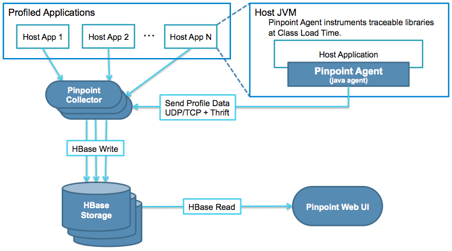

# Pinpoint APM Integration for OpenShift Container Platform

The objetive for this repository is to deploy the Pinpoint APM project (https://github.com/naver/pinpoint) on top of Openshift Container Platform.

1. Create the *pinpoint-apm* namespace on your Cluster

        # oc new-project pinpoint-apm

2. Import the template from source

        # oc create -f https://raw.githubusercontent.com/redhat-cop/containers-quickstarts/app_monitoring/ocp-pinpoint-apm/master/kube/pinpoint-template-ephemetal.yaml

3. Create the new application from the imported template

        # oc new-app pinpoint-ephemeral-template

      --> Deploying template "pinpoint-ephemeral-template" in project "openshift"

           pinpoint-ephemeral-template
           ---------
           Pinpoint APM Ephemeral

           Pinpoint APM Ephemeral

      --> Creating resources with label app=pinpoint-ephemeral-template

          serviceaccount "pinpoint" created
          imagestream "pinpoint" created
          service "pinpoint-apm" created
          service "pinpoint-testapp" created
          service "pinpoint-collector" created
          route "webinterface" created
          route "testapp" created
          buildconfig "pinpoint" created
          deploymentconfig "pinpoint-apm" created

      --> Success

          Build scheduled, use 'oc logs -f bc/pinpoint' to track its progress.
          Run 'oc status' to view your app.

4. Add the pinpoint service account to anyuid Security Context Constraint so root user could start processes inside de image

        # oc adm policy add-scc-to-user anyuid system:serviceaccount:pinpoint-apm:pinpoint

The resulting container will automatically start HBASE, Collector and Web UI services. The required routes will also created to expose Web UI and a Test Application. This Test Application must be manually started once the container is running.

        # oc rsh {Pod}
        # /pinpoint/quickstart/bin/start-testapp.sh &> /pinpoint/logs/testapp.out &

#### ** Note that the Build process could take more than 30 minutes depending on your hardware and internet connection. A public image will be available in Docker Hub to directly use it

## Overview

* **ServerMap** - Understand the topology of any distributed systems by visualizing how their components are interconnected. Clicking on a node reveals details about the component, such as its current status, and transaction count.

* **CallStack** - Gain code-level visibility to every transaction in a distributed environment, identifying bottlenecks and points of failure in a single view.

* **Inspector** - View additional details on the application such as CPU usage, Memory/Garbage Collection, TPS, and JVM arguments.

## Architecture

