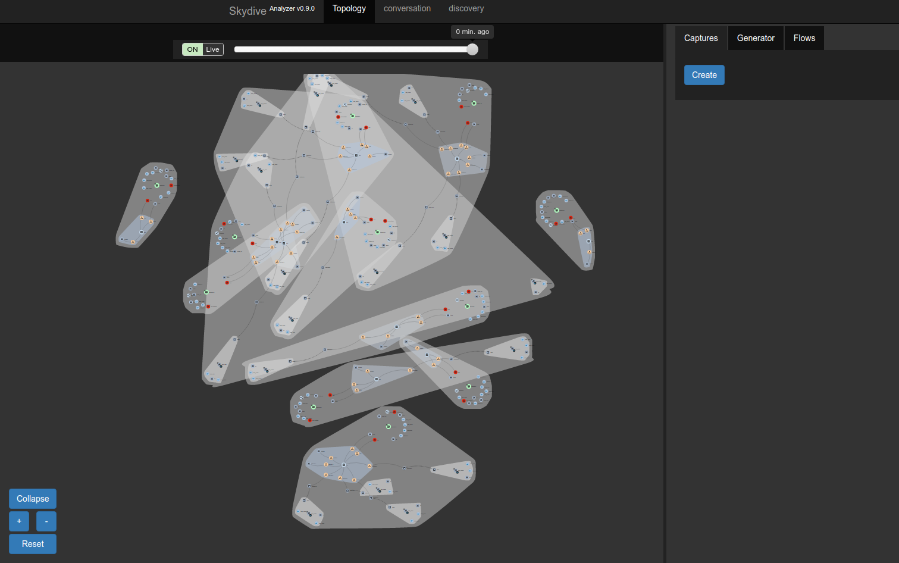
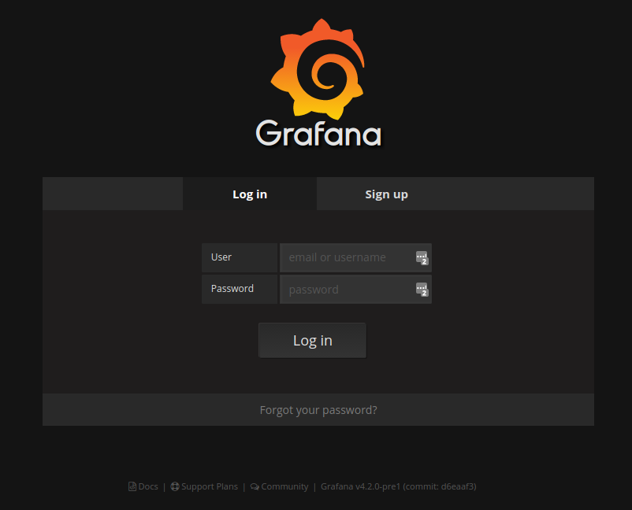
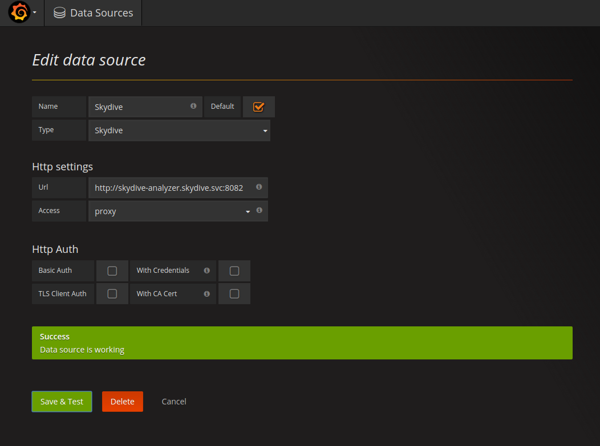
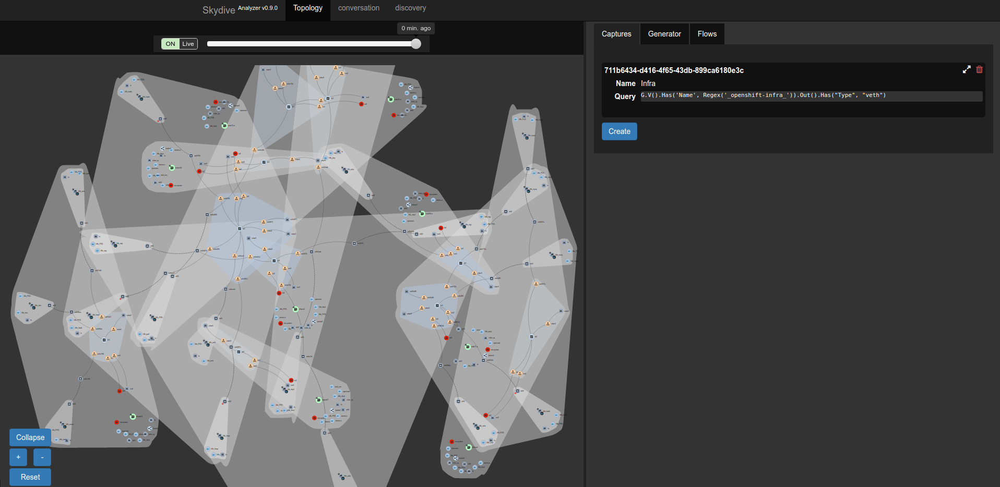
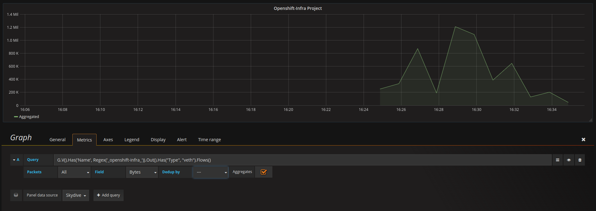

# Skydive for OCP and Grafana with skydive DataSource plugin

This repository is based in the Skydive Project (https://github.com/skydive-project/skydive), an open source real-time network topology and protocols analyzer.

Use the following instructions to deploy the full stack, Skydive + Grafana with Skydive plugin. Note that the Skydive Agent is configured to get information from the SDN using ovs-multitenant plugin for this particular example:

```
      # oc new-project skydive
      # oc create -f https://raw.githubusercontent.com/redhat-cop/containers-quickstarts/skydive-grafana/master/kube/skydive-template.json
      # oc adm policy add-scc-to-user privileged system:serviceaccount:skydive:default
      # oc new-app skydive
        --> Deploying template skydive

        --> Creating resources with label app=skydive ...
            service "skydive-analyzer" created
            deploymentconfig "skydive-analyzer" created
            daemonset "skydive-agent" created
            route "skydive-analyzer" created
        --> Success
            Run 'oc status' to view your app.

      In order to deploy all the skydive agents across your Nodes, label them accordingly:

      # oc label nodes --all skydive=true
```

As soon as the agent Pods are running, you will see all your Cluster topology in your Skydive Analyzer Web Interface.



Once the Skydive part is deployed we can now deploy the Grafana part:

```
      # oc create -f https://raw.githubusercontent.com/redhat-cop/containers-quickstarts/skydive-grafana/master/kube/grafana-skydive.json
        imagestream "grafana-skydive" created
        serviceaccount "grafana" created
        buildconfig "grafana-skydive" created
        service "grafana" created
        deploymentconfig "grafana-skydive" created
      # oc adm policy add-scc-to-user anyuid system:serviceaccount:skydive:grafana
```

This will build your Grafana image with skydive DataSource included and will deploy it. As soon as the Pod is running you will be able to access to Grafana using the created Route. Use the default user and password (admin/admin).



We need first to configure the DataSource to get info from the Skydive Analyzer instance. Select a descriptive name for this Data Source, and use 'Skydive' Type from the dropdown list. You will need to specify the URL of your Skydive Analyzer; you can use the Kubernetes Service DNS name is this will be resolved from your Grafana Pod, and port 8082. Select 'proxy' Access type and 'Save & Test' your Data Source.



Now the DataSource is configured, we can create a Dashboard to include metrics from Skydive. In order to get this metrics (Flows) we need to start a capture in Skydive (this requirement will removed in future releases) using the Skydive Web Interface or the Client (http://skydive-project.github.io/skydive/api/flows/). In this case and to avoid the manual creation of a skydive container (which requires OS privileges) we are going to create a new capture using the Web Interface. For this example, we are going to capture all the traffic for one particular namespace, 'openshift-infra'. This namespace is used in OCP for metrics collection, so if these are configured we will see some traffic there for sure. using the following Gremlin expression we can capture all this traffic. More information about Gremlin Query Language can fe found in the following link: http://skydive-project.github.io/skydive/api/gremlin/

        G.V().Has('Name', Regex('_openshift-infra_')).Out().Has("Type", "veth")

Go to Captures tab in Skydive Web Interface and create a new one specifying a descriptive name and using Gremlin Expression option. Once created you will be able to see some red points in your topology view corresponding to the interfaces where the traffic is being captured.



Once the capture is started we can show the results in Grafana. Add a new Graph using the new configured DataSource and use the same Gremlin Query we have used for the capture but now adding the '.Flows()' key as this is the data what Grafana is expecting for.

      G.V().Has('Name', Regex('_openshift-infra_')).Out().Has("Type", "veth").Flows()


